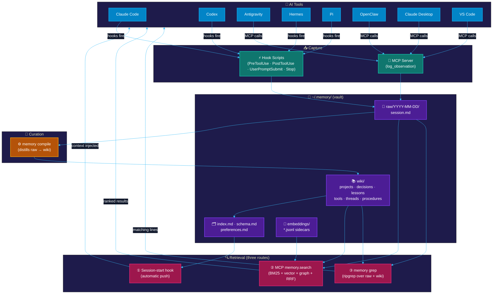
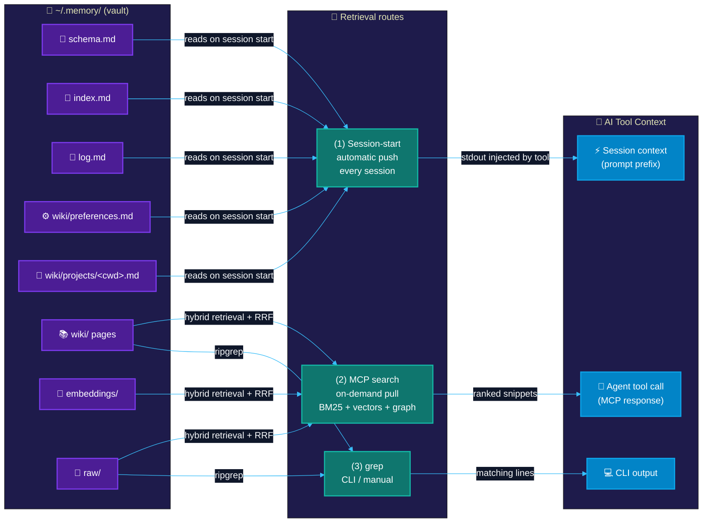

# Memory Fort

**Cross-tool persistent memory for AI agents — local, private, and free.**

Memory Fort gives every AI coding session a shared long-term memory: observations flow in automatically from Claude Code, Codex, Antigravity, Hermes, and Pi.
MCP integrations, including OpenClaw in v1, can log and recall memory on demand; a curated wiki of markdown pages grows over time; and retrieval (BM25 + semantic + graph) surfaces the right context at session start. No database. No external service. No API key to get started.

Your memory is a folder of plain text files — a git repo, an Obsidian vault, and a typed knowledge graph all at once.

---

## Why Memory Fort?

Most agent memory tools require a cloud account, a running database, or a paid API to work at all. Memory Fort does not.

- **Your data, your machine.** Everything lives under `~/.memory/` as markdown files you can read, edit, grep, and version-control.
- **No vendor lock-in.** Open schema, plain text format, vault is just a git repo.
- **No account required to start.** Lexical search (BM25 + graph) works on day one with zero API keys.
- **Obsidian-native.** Open `~/.memory/` in Obsidian and get a knowledge graph, backlinks, and full-text search for free.
- **Cross-tool hooks.** Claude Code, Codex, Antigravity, Hermes, and Pi write to the same vault automatically.
- **MCP-only clients.** OpenClaw uses the same vault through MCP without passive capture in v1.

---

## Quickstart

```bash
npx memory-fort init
```

Interactive wizard asks ≤4 questions (all pre-defaulted), detects your installed tools, and wires everything. Press Enter to accept all defaults.

**Prerequisites:** Node.js ≥ 20. Nothing else. No Docker, no database, no API key.

```bash
# Search immediately (no key needed)
memory-fort grep "your query"

# Browse and search in the UI
memory-fort dashboard
```

---

## How it works

### System architecture



### How memories reach your AI tools



**Route (1)** fires automatically — you always get your top context injected. **Routes (2) and (3)** are on-demand (agent or human asks).

---

## Supported tools

```bash
memory-fort install claude-code     # Claude Code (full hooks + plugin)
memory-fort install codex           # Codex desktop + CLI (hooks + MCP)
memory-fort install antigravity     # Google Antigravity / Gemini (MCP + live-capture plugin)
memory-fort install hermes          # Hermes agent (YAML hooks + MCP in ~/.hermes/config.yaml)
memory-fort install pi              # Pi coding agent (YAML hooks in ~/.pi/config.yaml)
memory-fort install openclaw        # OpenClaw (MCP server in ~/.openclaw/openclaw.json)
memory-fort install opencoven       # OpenCoven / Coven (read-only daemon readiness check)
memory-fort install opencode        # OpenCode (MCP config + selected event plugin)
memory-fort install claude-desktop  # Claude Desktop (MCP only)
memory-fort install vscode          # VS Code (MCP only)
```

All installs are **non-destructive and idempotent** — sentinel-block writes, re-running is safe. The OpenCoven target is read-only: it checks the `coven` CLI and the local `coven.daemon.v1` health contract, but does not launch sessions or write Memory Fort config.
OpenClaw support is MCP-only in v1: the installer preserves/updates its MCP config, but it does not install passive capture hooks or automatic observation capture.
OpenCode support has an implemented CLI surface, MCP config, and selected event plugin; live/operator smoke remains pending.

```bash
# Undo any integration cleanly
memory-fort uninstall claude-code
memory-fort disconnect --all
```

---

## Retrieval modes

| Mode | Needs | When to use |
|---|---|---|
| **Lexical (default)** | Nothing | Day 1, offline, private projects |
| **Voyage embeddings** | `VOYAGE_API_KEY` | Hosted semantic retrieval |
| **OpenAI embeddings** | `OPENAI_API_KEY` | Alternative to Voyage |
| **Ollama (local)** | Ollama running locally | Full local, no cloud at all |

Switch any time: edit `~/.memory/config.yaml` or re-run `memory-fort init`.

---

## Evidence posture

Memory Fort avoids reproduced-score and third-party benchmark claims unless they have been reproduced locally. Vendor-reported benchmark numbers must stay labeled as vendor-reported, and public claims should point to release evidence or implemented local behavior.

Current local evidence is intentionally narrower than a benchmark claim:

| Area | Current public claim | Evidence status |
|---|---|---|
| Default storage | Markdown + YAML files under `~/.memory/` | Implemented local package behavior |
| Default search | Lexical search works without an API key | Implemented local package behavior |
| Optional retrieval | Semantic and graph-assisted retrieval are available when configured | Local smoke evidence is recorded in `docs/release-evidence/2026-06-06-v1.1-credibility.md` |
| Package surface | Package uses the `files` whitelist in `package.json` | Local `npm pack --dry-run --json` evidence is recorded in the release evidence note |

Memory Fort does not currently publish a reproduced LongMemEval score or a reproduced third-party benchmark row. Use vendor benchmark numbers only as vendor-reported claims, not as Memory Fort certification.

---

## Wiki schema

Memory Fort organizes curated knowledge by entity type:

| Type | Directory | Purpose |
|---|---|---|
| `projects` | `wiki/projects/` | Codebases and work efforts |
| `decisions` | `wiki/decisions/` | Architecture and tooling choices, with alternatives |
| `lessons` | `wiki/lessons/` | Reusable facts learned from incidents |
| `references` | `wiki/references/` | Papers, posts, talks |
| `tools` | `wiki/tools/` | Libraries and services |
| `threads` | `wiki/threads/` | Narrative arcs across a stretch of work |
| `procedures` | `wiki/procedures/` | Reusable step-by-step workflows |

Pages link via typed graph edges (`uses`, `depends_on`, `supersedes`, `contradicts`, `caused_by`, `fixed_by`, `derived_from`). Plain YAML frontmatter — no database required.

---

## Dashboard

```bash
memory-fort dashboard
# → http://127.0.0.1:4410/memory/
```

Built-in React dashboard: browse the wiki, search (BM25 + semantic + graph), review proposed pages, inspect graph health metrics.

---

## Roadmap

- **Optional SQLite-FTS index** — rebuildable cache for sub-10ms lexical search at large vault sizes
- **Community integrations** — pull requests welcome; hook pattern documented in `docs/architecture.md`

---

## License

Memory Fort is **source-available** under the [PolyForm Noncommercial License 1.0.0](LICENSE) — free for personal use, hobby projects, and non-commercial research.

Commercial use requires a paid license. See [COMMERCIAL.md](COMMERCIAL.md).

## For contributors / private dev repo

After cloning, install the pre-push gate:

```bash
npm run install:dev-hooks
```

This gates every `git push origin` through `scan:leaks` so personal tokens can never accidentally reach the public repo.

---

*Built by [GalaxyRuler](https://github.com/GalaxyRuler)*
