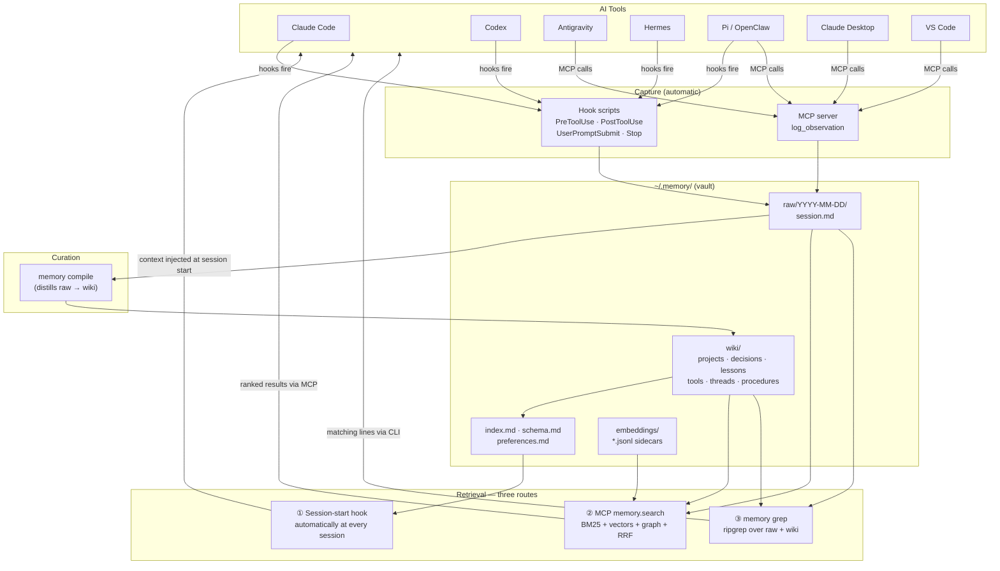
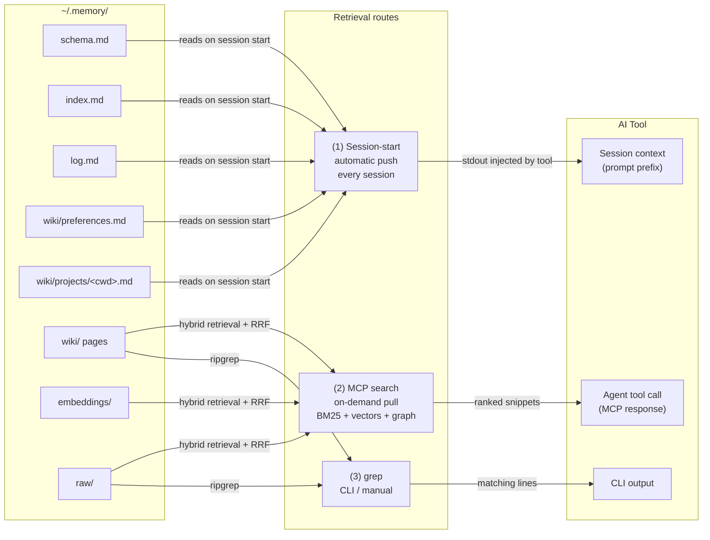

# Memory Fort

**Cross-tool persistent memory for AI agents — local, private, and free.**

Memory Fort gives every AI coding session a shared long-term memory: observations flow in automatically from Claude Code, Codex, Antigravity, Hermes, Pi, and OpenClaw; a curated wiki of markdown pages grows over time; and retrieval (BM25 + semantic + graph) surfaces the right context at session start. No database. No external service. No API key to get started.

Your memory is a folder of plain text files — a git repo, an Obsidian vault, and a typed knowledge graph all at once.

---

## Why Memory Fort?

Most agent memory tools require a cloud account, a running database, or a paid API to work at all. Memory Fort does not.

- **Your data, your machine.** Everything lives under `~/.memory/` as markdown files you can read, edit, grep, and version-control.
- **No vendor lock-in.** Open schema, plain text format, vault is just a git repo.
- **No account required to start.** Lexical search (BM25 + graph) works on day one with zero API keys.
- **Obsidian-native.** Open `~/.memory/` in Obsidian and get a knowledge graph, backlinks, and full-text search for free.
- **Cross-tool hooks.** Claude Code, Codex, Antigravity, Hermes, Pi, and OpenClaw all write to the same vault automatically — one memory across all your AI tools.

---

## Quickstart

```bash
npx memory-fort init
```

Interactive wizard asks ≤4 questions (all pre-defaulted), detects your installed tools, and wires everything. Press Enter to accept all defaults.

**Prerequisites:** Node.js ≥ 20. Nothing else. No Docker, no database, no API key.

```bash
# Search immediately (no key needed)
memory-fort grep "your query"

# Browse and search in the UI
memory-fort dashboard
```

---

## How it works

### System architecture



### How memories reach your AI tools



**Route (1)** fires automatically — you always get your top context injected. **Routes (2) and (3)** are on-demand (agent or human asks).

---

## Supported tools

```bash
memory-fort install claude-code     # Claude Code (full hooks + plugin)
memory-fort install codex           # Codex desktop + CLI (hooks + MCP)
memory-fort install antigravity     # Google Antigravity / Gemini (MCP + live-capture plugin)
memory-fort install hermes          # Hermes agent (YAML hooks + MCP in ~/.hermes/config.yaml)
memory-fort install pi              # Pi coding agent (YAML hooks in ~/.pi/config.yaml)
memory-fort install openclaw        # OpenClaw (MCP server in ~/.openclaw/openclaw.json)
memory-fort install claude-desktop  # Claude Desktop (MCP only)
memory-fort install vscode          # VS Code (MCP only)
```

All installs are **non-destructive and idempotent** — sentinel-block writes, re-running is safe.

```bash
# Undo any integration cleanly
memory-fort uninstall claude-code
memory-fort disconnect --all
```

---

## Retrieval modes

| Mode | Needs | When to use |
|---|---|---|
| **Lexical (default)** | Nothing | Day 1, offline, private projects |
| **Voyage embeddings** | `VOYAGE_API_KEY` | Best semantic recall |
| **OpenAI embeddings** | `OPENAI_API_KEY` | Alternative to Voyage |
| **Ollama (local)** | Ollama running locally | Full local, no cloud at all |

Switch any time: edit `~/.memory/config.yaml` or re-run `memory-fort init`.

---

## Memory Fort vs. other agent memory tools

All claims below are sourced from 2026 benchmarks and vendor documentation.

| | **Memory Fort** | **mem0** | **Zep / Graphiti** | **Letta** | **Cognee** | **LangMem** | **OMEGA** |
|---|---|---|---|---|---|---|---|
| **Storage** | Markdown files | Cloud DB / OSS | Cloud only¹ | PostgreSQL | SQLite + LanceDB | You choose | SQLite |
| **Requires API key** | ❌ No (lexical default) | ✅ Yes | ✅ Yes | ✅ Yes (LLM) | ✅ Yes (LLM) | ✅ Yes (LLM) | ❌ No |
| **Self-hosted** | ✅ Always | ✅ OSS option | ❌ Dropped¹ | ✅ Free | ✅ Local | ✅ OSS | ✅ |
| **Offline / air-gapped** | ✅ | ❌ | ❌ | ❌ | ✅ (local LLM) | ❌ | ✅ |
| **Human-readable** | ✅ Markdown + YAML | ❌ | ❌ | ❌ | ❌ | ❌ | ❌ |
| **Obsidian-compatible** | ✅ Native | ❌ | ❌ | ❌ | ❌ | ❌ | ❌ |
| **Git-backed** | ✅ Built-in | ❌ | ❌ | ❌ | ❌ | ❌ | ❌ |
| **Multi-tool hooks** | ✅ 6 tools | ❌ | ❌ | ❌ | ❌ | ❌ | ❌ |
| **Knowledge graph** | ✅ Typed edges (free) | ✅ Pro only ($249/mo) | ✅ Graphiti | ✅ All tiers | ✅ All tiers | ❌ | ❌ |
| **LongMemEval** | — | 49.0%² | 63.8%² | — | — | 59.8s p95 latency³ | 95.4%⁴ |
| **Free tier** | Unlimited (local) | 10K memories, 1K calls/mo | ❌ | ✅ self-hosted | ✅ self-hosted | ✅ OSS | Unlimited |
| **TypeScript SDK** | ✅ Native CLI + MCP | ✅ | ✅ | partial | ❌ Python only | partial | ❌ |

¹ Zep dropped its self-hosted Community Edition in 2025; Zep Cloud is now the only supported path.  
² [Agent Memory at Scale 2026 — AgentMarketCap](https://agentmarketcap.ai/blog/2026/04/10/agent-memory-vendor-landscape-2026-letta-zep-mem0-langmem)  
³ [Best AI Agent Memory Frameworks 2026 — Atlan](https://atlan.com/know/best-ai-agent-memory-frameworks-2026/)  
⁴ [OMEGA comparison page](https://omegamax.co/compare)

### When to choose something else

- **mem0** — managed cloud, polished dashboard, widest language support, largest community.
- **Zep / Graphiti** — best temporal fact tracking; reason about *when* facts changed.
- **Letta** — full stateful agent runtime, not just memory.
- **Cognee** — rich multimodal pipeline (images, audio, documents); Python-only.
- **LangMem** — natural fit on LangChain/LangGraph; note the high p95 latency for interactive use.
- **OMEGA** — fully local + AES-256 encryption at rest; no multi-tool hook support.

---

## Wiki schema

Memory Fort organizes curated knowledge by entity type:

| Type | Directory | Purpose |
|---|---|---|
| `projects` | `wiki/projects/` | Codebases and work efforts |
| `decisions` | `wiki/decisions/` | Architecture and tooling choices, with alternatives |
| `lessons` | `wiki/lessons/` | Reusable facts learned from incidents |
| `references` | `wiki/references/` | Papers, posts, talks |
| `tools` | `wiki/tools/` | Libraries and services |
| `threads` | `wiki/threads/` | Narrative arcs across a stretch of work |
| `procedures` | `wiki/procedures/` | Reusable step-by-step workflows |

Pages link via typed graph edges (`uses`, `depends_on`, `supersedes`, `contradicts`, `caused_by`, `fixed_by`, `derived_from`). Plain YAML frontmatter — no database required.

---

## Dashboard

```bash
memory-fort dashboard
# → http://127.0.0.1:4410/memory/
```

Built-in React dashboard: browse the wiki, search (BM25 + semantic + graph), review proposed pages, inspect graph health metrics.

---

## Roadmap

- **OpenCode** integration (`memory-fort install opencode`) — plugin drop into `~/.config/opencode/plugins/`
- **Optional SQLite-FTS index** — rebuildable cache for sub-10ms lexical search at large vault sizes
- **Community integrations** — pull requests welcome; hook pattern documented in `docs/architecture.md`

---

## License

Memory Fort is **source-available** under the [PolyForm Noncommercial License 1.0.0](LICENSE) — free for personal use, hobby projects, and non-commercial research.

Commercial use requires a paid license. See [COMMERCIAL.md](COMMERCIAL.md).

## For contributors / private dev repo

After cloning, install the pre-push gate:

```bash
npm run install:dev-hooks
```

This gates every `git push origin` through `scan:leaks` so personal tokens can never accidentally reach the public repo.

---

*Built by [GalaxyRuler](https://github.com/GalaxyRuler)*
