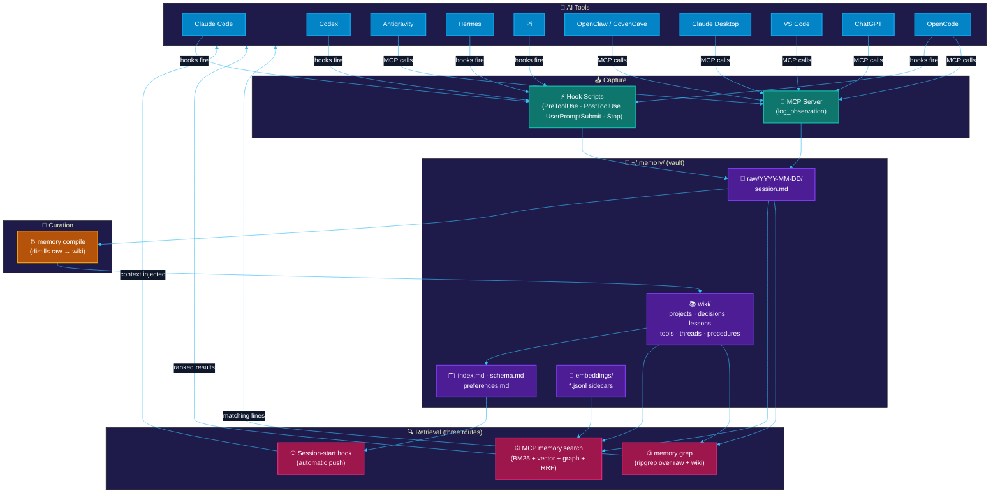
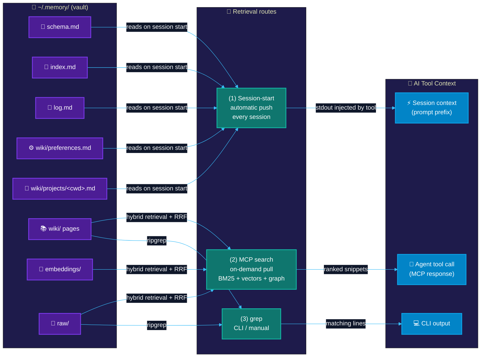

<p align="center">
  
  <br />
  <picture>
    <source media="(prefers-color-scheme: dark)" srcset="assets/memory_fort_wordmark.png" />
    <source media="(prefers-color-scheme: light)" srcset="assets/memory_fort_wordmark_light.png" />
    
  </picture>
</p>

<p align="center">
  <strong>Cross-tool persistent memory for AI agents — local, private, and free.</strong>
</p>

<p align="center">
  <em>Your agents remember. Your data stays home.</em>
</p>

Memory Fort gives every AI coding session a shared long-term memory: observations flow in automatically from Claude Code, Codex, Antigravity, Hermes, Pi, ChatGPT, and OpenCode.
MCP integrations, including OpenClaw in v1, can log and recall memory on demand; search results include detailed provenance receipts explaining ranking decisions; a curated wiki of markdown pages grows over time; and retrieval (BM25 + semantic + graph) surfaces the right context at session start. No database. No external service. No API key to get started.

Your memory is a folder of plain text files — a git repo, an Obsidian vault, and a typed knowledge graph all at once.

---

## Why Memory Fort?

Memory Fort does not require a cloud account, a running database, or a paid API key to get started; its local vault and lexical search run from plain markdown files.

- **Your data, your machine.** Everything lives under `~/.memory/` as markdown files you can read, edit, grep, and version-control.
- **No vendor lock-in.** Open schema, plain text format, vault is just a git repo.
- **No account required to start.** Lexical search (BM25 + graph) works on day one with zero API keys.
- **Obsidian-native.** Open `~/.memory/` in Obsidian and get a knowledge graph, backlinks, and full-text search for free.
- **Cross-tool hooks.** Claude Code, Codex, Antigravity, Hermes, Pi, ChatGPT, and OpenCode write to the same vault automatically.
- **MCP-only clients.** OpenClaw uses the same vault through MCP without passive capture in v1.

---

## Quickstart

```bash
npx memory-fort init
```

Interactive wizard asks ≤4 questions (all pre-defaulted), detects your installed tools, and wires everything. Press Enter to accept all defaults. It also creates a **desktop shortcut** that launches the dashboard (Windows `.lnk` / macOS `.command` / Linux `.desktop`) so non-technical users can open Memory Fort with one click.

**Prerequisites:** Node.js ≥ 20. Nothing else. No Docker, no database, no API key.

```bash
# Search immediately (no key needed)
memory-fort grep "your query"

# Browse and search in the UI
memory-fort dashboard
```

### First-run checklist

1. Install Node.js 20 or newer.
2. Run `npx memory-fort init` and accept the keyless lexical retrieval default unless you already know which embedding provider you want.
3. Start the dashboard with `memory-fort dashboard` and open the printed `http://127.0.0.1:4410/memory/` URL.
4. In Settings, confirm the embedder is `lexical` for a no-key setup, or choose Voyage, OpenAI, Ollama, or OpenAI-compatible and save the provider settings.
5. Add API keys from the dashboard only when using hosted providers; keys are stored outside the git-backed vault and are never written into `~/.memory/config.yaml`.
6. Turn off clients you do not want Memory Fort to use. Turning a client off preserves its saved setup; `memory-fort disconnect <client>` removes the integration config.
7. Run `memory-fort doctor` or `memory-fort verify` after connecting clients to confirm the vault, providers, dashboard, and integrations are healthy.

---

## How it works

### System architecture



### How memories reach your AI tools



**Route (1)** fires automatically — you always get your top context injected. **Routes (2) and (3)** are on-demand (agent or human asks).

---

## Supported tools

```bash
memory-fort install claude-code     # Claude Code (full hooks + plugin)
memory-fort install codex           # Codex desktop + CLI (hooks + MCP)
memory-fort install antigravity     # Google Antigravity / Gemini (MCP + live-capture plugin)
memory-fort install hermes          # Hermes agent (YAML hooks + MCP in ~/.hermes/config.yaml)
memory-fort install pi              # Pi coding agent (YAML hooks in ~/.pi/config.yaml)
memory-fort install chatgpt         # ChatGPT (HTTP/SSE bridge for ChatGPT Connectors)
memory-fort install openclaw        # OpenClaw (MCP server in ~/.openclaw/openclaw.json)
memory-fort install opencoven       # OpenCoven / CovenCave (read-only daemon readiness check)
memory-fort install opencode        # OpenCode (MCP config + selected event plugin)
memory-fort install claude-desktop  # Claude Desktop (MCP only)
memory-fort install vscode          # VS Code (MCP only)
```

See [`docs/cli.md`](docs/cli.md) for full CLI reference (all subcommands, flags, examples).

All installs are **non-destructive and idempotent** — sentinel-block writes, re-running is safe. The OpenCoven / CovenCave target is read-only: it checks the `coven` CLI and the local `coven.daemon.v1` health contract, but does not launch sessions or write Memory Fort config. It is part of the OpenCoven family.

OpenClaw support is MCP-only in v1: the installer preserves/updates its MCP config, but it does not install passive capture hooks or automatic observation capture.

OpenCode support features MCP config wiring and selected event plugin installation for hook capture, with CLI diagnostics integration.

ChatGPT connects through an HTTP/SSE bridge server (default `localhost:3100`) that translates MCP stdio into HTTP Server-Sent Events, which ChatGPT's "Connectors" feature can consume. You can manage the bridge via the CLI (`memory-fort chatgpt-bridge start|stop|status`) or configure the port in `~/.memory/config.yaml` under `chatgpt.bridge_port`. Autostart on Windows is supported via the HKCU Run registry key (best-effort).

Disable vs disconnect:

- **Disable temporarily:** use the dashboard Settings → Clients switches, or set `clients.<client>: false` in `~/.memory/config.yaml`. This keeps saved configuration but makes supported hooks, MCP observations, and verify checks skip that client.
- **Disconnect/remove setup:** run `memory-fort disconnect <client>` or `memory-fort disconnect --all`. This removes the integration files or connector setup where the platform supports removal.
- **ChatGPT is opt-in:** the bridge stays disabled until `memory-fort install chatgpt` or `clients.chatgpt: true` enables it.

```bash
# Undo any integration cleanly
memory-fort uninstall claude-code
memory-fort uninstall chatgpt
memory-fort disconnect --all
```

---

## Retrieval modes

| Mode | Needs | When to use |
|---|---|---|
| **Lexical (default)** | Nothing | Day 1, offline, private projects |
| **Voyage embeddings** | `VOYAGE_API_KEY` | Hosted semantic retrieval |
| **OpenAI embeddings** | `OPENAI_API_KEY` | Alternative to Voyage |
| **Ollama (local)** | Ollama running locally | Full local, no cloud at all |
| **OpenAI-compatible endpoint** | Local/compatible HTTP endpoint | Advanced local gateways; dashboard stores endpoint URL and dimension, not API keys |

Switch any time: edit `~/.memory/config.yaml` or re-run `memory-fort init`.

Provider checks:

```bash
memory-fort provider list-embedders
memory-fort provider test-embedder
memory-fort provider list-llms
memory-fort provider test-llm
```

Search results include provenance receipts showing BM25, embedding, and graph signals — visible in the dashboard and MCP API.

---

## Compile & cost control

`memory compile` distills raw observations into wiki pages. Compilation is built to stay cheap and safe at scale:

- **Pre-LLM raw filter** (`compile.raw_filter`) strips tool-output noise (build logs, file dumps, base64/image data, ANSI) *before* the LLM sees it — roughly 55% fewer tokens corpus-wide and up to ~88% on large tool-heavy sessions, while preserving prompts, assistant decisions, tool commands, findings, and signal lines (errors, diffs, commit lines, test counts). Slices that are provably all-noise skip the LLM entirely and just advance the watermark.
- **Condensed index injection** (`compile.condensed_index`) sends a compact title+path index each pass instead of the full `index.md`, cutting the fixed per-pass overhead.
- **Daily keep-up drain** (`compile.drain`, `compile.max_passes_per_run`) clears each day's intake so the raw backlog never balloons.
- **`memory compile --filter-report [--json]`** previews exactly what the filter would strip — no LLM calls, no writes — so you can validate before enabling it.
- **Cost observability** — every LLM call's `cost_usd` is recorded in `wiki/.audit/llm-*.md` (OpenRouter per-call cost with a pricing-table fallback), and the `compile.filter-health` verify check surfaces reduction and backlog trend.

**Core memories:** explicit operator directives ("always X", "never Y") are extracted into individual `wiki/preferences/<slug>.md` pages tagged `cognitive_type: core`. Rewrites preserve a page's accumulated curated graph relations (they are unioned, not replaced).

Search also supports **temporal filtering** (`as_of=YYYY-MM-DD` returns only pages valid at that date, using inclusive `valid_from`/`valid_until` bounds) and **identity-aware filtering** (`agent_id`/`user_id` scoped retrieval with inclusive or strict modes — a retrieval preference, not security isolation). Both are available on the HTTP API, MCP `search` tool, and SDKs.

When Voyage embeddings are enabled, Memory Fort uses **contextualized text embedding**: each wiki page is embedded with a graph-topology header (path, type, relations, tags, backlinks) prepended, improving recall for graph-aware queries. Enable via `retrieval.embeddings.contextualized: true` in config.yaml.

---

## Evidence posture

Memory Fort avoids reproduced-score and third-party benchmark claims unless they have been reproduced locally. Vendor-reported benchmark numbers must stay labeled as vendor-reported, and public claims should point to release evidence or implemented local behavior.

Current local evidence is intentionally narrower than a benchmark claim:

| Area | Current public claim | Evidence status |
|---|---|---|
| Default storage | Markdown + YAML files under `~/.memory/` | Implemented local package behavior |
| Default search | Lexical search works without an API key | Implemented local package behavior |
| Search provenance | Search results include detailed provenance receipts showing ranking decisions | Implemented in MCP response (`provenance` field) and dashboard UI |
| Optional retrieval | Semantic and graph-assisted retrieval are available when configured | Local smoke evidence is recorded in `docs/release-evidence/2026-06-06-v1.1-credibility.md` |
| Package surface | Package uses the `files` whitelist in `package.json` | Local `npm pack --dry-run --json` evidence is recorded in the release evidence note |

Memory Fort does not currently publish a reproduced LongMemEval score or a reproduced third-party benchmark row. Use vendor benchmark numbers only as vendor-reported claims, not as Memory Fort certification.

Two local evals run on every CI push against deterministic checked-in fixtures, with scores rendered in the GitHub job summary:

- **Graph-aware retrieval eval** — `memory eval-retrieval --gold qa/graph-aware-gold.jsonl --corpus qa/fixtures/graph-aware-vault` (recall@k + MRR, with/without graph spread)
- **Dispatch policy eval** — `memory eval dispatch` (classifyDispatch truth-table accuracy; fails CI summary on any drift)

---

## Wiki schema

Memory Fort organizes curated knowledge by entity type:

| Type | Directory | Purpose |
|---|---|---|
| `projects` | `wiki/projects/` | Codebases and work efforts |
| `decisions` | `wiki/decisions/` | Architecture and tooling choices, with alternatives |
| `lessons` | `wiki/lessons/` | Reusable facts learned from incidents |
| `references` | `wiki/references/` | Papers, posts, talks |
| `tools` | `wiki/tools/` | Libraries and services |
| `threads` | `wiki/threads/` | Narrative arcs across a stretch of work |
| `procedures` | `wiki/procedures/` | Reusable step-by-step workflows |
| `preferences` | `wiki/preferences/` | Core memories — durable operator preferences/conventions (`cognitive_type: core`) |

Pages link via typed graph edges (`uses`, `depends_on`, `supersedes`, `contradicts`, `caused_by`, `fixed_by`, `learned_from`, `derived_from`, `mentions`, `mentioned_in`, `linked`). Plain YAML frontmatter — no database required.

---

## Dashboard

```bash
memory-fort dashboard
# → http://127.0.0.1:4410/memory/
```

**Write capability requires a git vault.** Write endpoints (`POST /api/observations`, `/api/sync`, proposal actions, config patches) only work when the vault directory is a git repository — non-git vaults are treated as read-only mirrors and return HTTP 403 with `read-only mirror — run 'memory dashboard' on your machine to make changes`. `memory-fort init` sets up git automatically; if you created a vault by hand, run `git init` inside it.

Built-in React dashboard:
- Browse the wiki, search (BM25 + semantic + graph), review proposed pages, inspect graph health metrics.
- Audit ranking decisions using **search provenance receipts** (expandable detail showing BM25, embedding, and graph weights).
- Manage integrations using **client toggles** to enable or disable individual clients (configured via `clients.*` map in `config.yaml`, with verify checks automatically skipping disabled clients).
- Securely manage API credentials via **API key management** (masked secrets fields stored outside the vault with test-then-save validation flow).
- Check and manage the **ChatGPT bridge status** (verify checks: `chatgpt.bridge.running` and `chatgpt.bridge.mcp`).
- Review **lifecycle proposals** (`wiki/compile-proposed/`) — dispute and supersede candidates staged for human review before any wiki edit.

---

## SDKs

One-liner client packages wrapping the local HTTP API:

```typescript
// npm install memory-fort-sdk
import { MemoryFortClient } from "memory-fort-sdk";
const client = new MemoryFortClient();
await client.add("Switched from ESLint to Biome");
const hits = await client.search("voyage embeddings", { k: 5, asOf: "2026-03-01" });
```

```python
# pip install memory-fort
from memory_fort import MemoryFortClient
async with MemoryFortClient() as client:
    await client.add("Switched from ESLint to Biome")
    hits = await client.search("voyage embeddings", k=5, as_of="2026-03-01")
```

Both live in [`packages/`](packages/) and require a running `memory-fort dashboard`.

---

## Roadmap

- **Optional SQLite-FTS index** — rebuildable cache for sub-10ms lexical search at large vault sizes
- **Community integrations** — pull requests welcome; hook pattern documented in `docs/architecture.md`

---

## License

Memory Fort is open source under the [GNU General Public License v3.0](LICENSE) (`GPL-3.0-only`).

Commercial use is permitted under the GPLv3 terms. There is no separate commercial license requirement for this repository.

## For contributors / private dev repo

After cloning, install the pre-push gate:

```bash
npm run install:dev-hooks
```

This gates every `git push origin` through `scan:leaks` so personal tokens can never accidentally reach the public repo.

---

<p align="center">
  
  <br />
  <em>Built by <a href="https://github.com/GalaxyRuler">GalaxyRuler</a></em>
</p>
