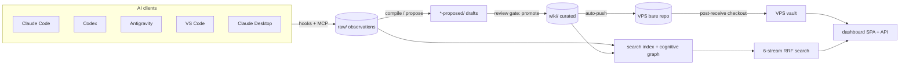

# Memory Fort — Full System Specification

> **Status:** living reference, generated 2026-05-28 from the codebase at `C:\CodexProjects\memory-system`.
> **Package:** `@galaxyruler/memory-system` v0.1.0 · ~301 TS/TSX source files · ~195 test files.
> **Scope:** architecture, data model, every subsystem (frontend, backend, capture, consolidation, retrieval, sync, CLI, deployment), security model, and the phase history.

---

## 1. What Memory Fort is

Memory Fort is a **personal agent-memory system**: a durable, queryable memory that AI coding agents (Claude Code, Codex, Antigravity, VS Code, Claude Desktop) write to and read from across sessions. It is built on four pillars:

1. **A markdown vault** at `~/.memory` — plain files, human-readable, git-versioned. No database; the filesystem *is* the store.
2. **A cognitive graph** — typed relations between memory entities, with health metrics measuring the graph's shape.
3. **A retrieval pipeline** — six-stream search (lexical + semantic + graph) fused via Reciprocal Rank Fusion and reranked.
4. **A dashboard** — a React SPA + HTTP API for browsing, search, health, and operator review of machine-proposed memories.

The design philosophy: **capture is cheap and automatic; consolidation is gated and reviewable.** Raw observations stream in passively via hooks; turning them into curated knowledge always passes a two-stage `propose → review → promote` gate so that LLM hallucination never silently pollutes canonical memory.

### Core model

- **Raw layer** (`raw/`): the firehose. Every prompt, tool call, and observation captured per session.
- **Curated layer** (`wiki/`): distilled, human-or-review-gated knowledge pages.
- **Consolidation**: `compile` and the propose pipelines turn raw → curated.
- **Sync**: git push to a VPS bare repo; a dashboard serves the checked-out vault.



---

## 2. Tech stack & repository structure

**Runtime/tooling:** Node (ESM), TypeScript. Build via `tsdown` (esbuild/rolldown — transpile only, no typecheck). Dashboard UI via Vite. Tests via Vitest.

**Key dependencies:** `@modelcontextprotocol/sdk` (MCP server), `commander` (CLI), `gray-matter` + `js-yaml` (frontmatter/config), `voyageai` + `openai` (embeddings/LLM), `@tanstack/react-router` + `@tanstack/react-query` + `react` 19 + `tailwindcss` + `cmdk` + `lucide-react` + `react-markdown` (dashboard).

**`src/` subsystems:**

| Dir | Responsibility |
|---|---|
| `storage/` | atomic writes, paths, frontmatter, config, confidence |
| `hooks/` | capture hooks (session-start, prompt-submit, post-tool-use, pre-compact, session-end) |
| `mcp/` | the `memory` MCP server (log_observation, search, list_pages, read_page) |
| `sniffers/` | per-client session capture adapters + backfill |
| `sync/` | auto-push, detached worker, commit-vault-change |
| `consolidate/` | thread clustering, procedure detection, entity dedup |
| `compile/` | canonicalize, autonomous compile execution |
| `llm/` | provider abstraction, audit, proposal grounding/confidence, propose pipelines |
| `retrieval/` | 6-stream search, RRF, rerank, query-intent, embedder abstraction, graph |
| `curation/` | curation helpers |
| `dashboard/` | HTTP server, API, graph-health, loaders, scheduler |
| `dashboard-ui/` | TanStack Router SPA |
| `cli/` | commander CLI + verify checks |
| `migration/`, `eval/` | agentmemory import, LongMemEval harness |

**Build/test scripts:** `build` (tsdown), `build:ui` (vite), `build:all`, `typecheck` (`tsc --noEmit`, added Phase 4.3.P — note the bundler does *not* typecheck), `test` (vitest), `test:ui`, `test:watch`.

---

## 3. Cognitive & data model

### Cognitive types (`frontmatter.cognitive_type`)

| Type | Meaning | Typical domain pages |
|---|---|---|
| `core` | fundamental facts/definitions | projects, references |
| `semantic` | entity definitions + relationships | projects, people, tools, references |
| `episodic` | temporal events/narratives | threads, lessons, raw sessions |
| `procedural` | repeatable how-to workflows | procedures |
| `prospective` | future obligations (due/triggers/expires) | prospective |

### Domain categories (`wiki/` subdirectories)

`projects`, `people`, `decisions`, `lessons`, `references`, `tools` (user-curated) · `threads`, `procedures` (consolidated from raw) · `threads-proposed`, `procedures-proposed`, `compile-proposed` (review staging) · `crystals` (long-form distillations) · `.audit` (operational logs — **not** entities).

### Frontmatter schema (`src/storage/frontmatter.ts`)

```yaml
type: <EntityType>            # PageType | "crystal" | "raw-session"
title: <string>
cognitive_type: core|semantic|episodic|procedural|prospective
source: <agent/tool>
lifecycle: observed|linked|proposed|consolidated|canonical|stale|disputed|dormant|archived
status: active|archived|superseded
confidence:                  # number OR ConfidenceVector:
  extraction: 0..1
  source: 0..1
  validation: unvalidated|auto|user|challenged|revoked
  freshness: <date>
  conflict: <string|null>
created: YYYY-MM-DD
updated: YYYY-MM-DD
time_range: { start, end }    # episodic
due / expires / triggers      # prospective
tags: [..]
relations:                    # typed edges (RelationMap)
  mentions|contradicts|supersedes|derived_from|uses|depends_on|caused_by|fixed_by|mentioned_in|linked:
    - target: <relPath>
      confidence: 0..1
      valid_from / valid_to / superseded_by
      source: { agent, session_id, captured_at }
session: <id>                 # raw-session only
```

`parseFrontmatter` / `serializeFrontmatter` / `validateFrontmatter` are the I/O surface. `src/storage/confidence.ts` derives a scalar score, validation state, and lifecycle stage (path-prefix heuristic: `raw/`→observed, `wiki/`+conf≥0.6→canonical, else proposed).

---

## 4. Storage layer (`src/storage/`)

- **`atomic-write.ts`** — `atomicWrite(path, content)` writes via tmp+rename, crash-safe, creates parent dirs. **Windows retry** (Phase 4.3.L): retries `EPERM/EACCES/EBUSY/ENOENT` at 50/150/400 ms (POSIX skips retry); tracks `atomicWriteRetryStats {writes, success, exhausted}`. `atomicAppend(path, content)` — atomic for ≤KB payloads.
- **`paths.ts`** — `memoryRoot()` (`~/.memory` or `$MEMORY_ROOT`), `wikiDir(category)`, `rawDir/rawSessionFile`, `threadsDir/proceduresDir` (+ `-proposed`), `crystalsDir`, `configPath/indexPath/logPath/errorsLogPath`, plus client config paths.
- **`frontmatter.ts`** — schema above.
- **`config.ts`** — `loadMemoryConfig()` → `MemoryConfig` (§17), parsed through `js-yaml` JSON schema so ordinary YAML features work while dates remain strings.
- **`confidence.ts`** — scoring helpers.

### Vault layout (`~/.memory/`)

```
index.md              curated wiki summary (injected at session-start)
log.md                append-only event trail
schema.md             the controlling schema doc
config.yaml           runtime settings (no secrets)
errors.log            hook/sync failures (newline-delimited)
.entity-aliases.json  entity dedup alias map
.auto-push-pending    debounce coordination (lock + token)
.sync-state.json      last_sync_success, pending_push_count, conflict_files[]
wiki/<category>/*.md  curated pages
wiki/.audit/*.md      LLM audit logs, compile/propose run logs (operational, NOT entities)
raw/YYYY-MM-DD/*.md   per-session observation files (<tool>-<sessionId>.md)
```

---

## 5. Capture (`src/hooks/`, `src/mcp/`, `src/sniffers/`)

### Hooks

Fired by host tools with a stdin JSON payload; wrapped by `runHook` (always exits 0 so a hook never breaks the host; errors route to `errors.log`).

| Hook | Behaviour |
|---|---|
| `session-start` | Emits a context block to stdout: **`schema.md` + `index.md` + last 20 `log.md` lines** (this is the only memory injected into a fresh agent context) |
| `prompt-submit` | Appends `## [HH:MM:SS] Prompt` block to the raw session file |
| `post-tool-use` | Appends `## [HH:MM:SS] ToolUse: <name>` with input + truncated output (8 KB cap), then `scheduleAutoPush()` |
| `pre-compact` | Appends a compaction marker before host context compaction |
| `session-end` | Appends a `SessionEnd` marker, schedules auto-push |

`raw-file.ts` provides `ensureRawSessionFile` (writes frontmatter header) and `appendBlock` (UTF-8-safe truncation).

### MCP server (`src/mcp/server.ts`)

The `memory` MCP server (run from `~/.memory/claude-code-plugin/scripts/mcp-server.mjs`) exposes four Zod-validated tools:

- `log_observation({text, tags?, confidence?, source?})` — deliberate "remember this" → writes an observation block to today's raw file.
- `read_page({path})` — read a curated wiki page.
- `list_pages({type?, tag?, status?})` — list curated pages.
- `search({query, scope, k, min_score, no_rerank?, hyde_expansion?})` — full retrieval pipeline (delegates to the backend).

### Sniffers (`src/sniffers/`)

Adapter pattern (`Sniffer` interface: `available()`, `list({since,limit})`, optional `watch()`) normalizing each client's session store into a `RawSession` written to `raw/<date>/<source>-<sessionId>.md`. Implemented for claude-code (`~/.claude/projects/**/*.jsonl`), codex, antigravity, vscode, claude-desktop. Backfill imports historical sessions.

---

## 6. Sync (`src/sync/`)

- **`auto-push.ts`** — `scheduleAutoPush()` writes `.auto-push-pending` (token + debounce 5 s) behind an exclusive `.lock`, spawns a detached worker. Adds `.auto-push-pending`/`auto-sync.log` to `.git/info/exclude`.
- **`auto-push-worker.ts`** — detached process: waits the debounce, commits dirty `raw/` files (`autoCommitRawsIfDirty` — skips if non-raw files are dirty, to avoid clobbering in-progress edits), then `sync()` (pull-rebase + push). Conflict (exit 3) → records `conflict_files` in `.sync-state.json`.
- **`commit-vault-change.ts`** (Phase 4.3.R/S) — `commitVaultChange({paths, message})` for mutation ops (promote/reject/merge). Filters paths to on-disk-or-tracked, stages with `git add -A -- <filtered>` (handles moves where the source path is gone), best-effort (logs on failure, never throws), then schedules auto-push.

**VPS topology:** local vault pushes to a **bare repo** (`root@<host>:/root/memory-system/memory.git`); a **post-receive hook** checks out into `/root/memory-system/vault`, which the dashboard reads. Sync only propagates *commits* — every vault mutation must commit (the role of `commitVaultChange`).

---

## 7. Consolidation (`src/consolidate/`, `src/compile/`, `src/llm/*-propose.ts`)

### Compile (raw → curated wiki)

`runCompile` (`src/cli/commands/compile.ts`): walks `raw/` since the last compile (per-file 10 KB / total 200 KB caps), renders `templates/prompts/compile.md` with schema + index + log + raw. Two modes:

- **Artifact mode** (default): prints the rendered prompt to stdout (or writes to a file when `--output <path>` is given) for an agent to execute. The dashboard keeps this as the secondary **Generate prompt only** action and returns the scheduled prompt artifact path.
- **Execute mode** (Phase 4.4, opt-in `--execute`; dashboard primary action in Phase 4.13): sends the prompt to the LLM, parses `compile-ops`, applies high-confidence operations directly, and stages low-confidence operations in `wiki/compile-proposed/`.

The compile prompt is **append-only by contract**: never rewrite/delete existing content, only add dated `## [<date>] update` sections; never invent relations; never leak secrets; new pages start `confidence 0.5–0.7`.

**`src/compile/execute.ts`** (Phase 4.4/4.9) — `CompileOperation` discriminated union: `write_page` (create; refuses if target exists), `append_page` (preserve body + append section), `update_index`, `append_log`. Each operation is **grounded** (`filterWikiReferencesToExisting` + `stripProsePathLeaksFromText`), **secret-redacted** (`KEY=value` secret assignments, bare `sk-…` tokens, Google `AIza…` keys, GitHub `gh[p|o|s|u|r]_…` tokens, `Bearer …` tokens, Slack `xox…` tokens, and PEM private-key blocks → `[REDACTED]`), **path-guarded** (no `..`/absolute/drive paths), and **confidence-gated**: high-confidence applies directly, low-confidence stages to `wiki/compile-proposed/`. `src/compile/canonicalize.ts` assigns per-source confidence tiers (manual 0.85, crystal 0.9, claude-code/codex 0.75, antigravity 0.6, unknown 0.5) and topic/tool tags.

### Narrative threads (Phase 4.3.D)

`clusterRawObservations` (`thread-cluster.ts`): Jaccard similarity over entity sets within a 7-day window; merges at Jaccard ≥0.5; requires ≥3 obs; emits `ThreadCluster {observations, sharedEntities, timeRange, cohesionScore}`. `proposeThread` (`thread-propose.ts`): LLM drafts a `ThreadProposal {title 10–80, summary, keyDecisions, keyLessons, openQuestions, proposedSlug, grounding}`; parser returns a discriminated union (`{ok, proposal}` | `{ok:false, reason}`) supporting an explicit `skip:` path. Drafts land in `threads-proposed/` → `memory thread promote` → `threads/`.

### Procedures (Phase 4.3.E)

`detectProcedureClusters` (`procedure-detect.ts`): extracts command signatures from fenced blocks / shell prompts, clusters by command-set Jaccard (≥0.4), requires ≥3 obs across ≥2 sessions and a successful outcome. `proposeProcedure`: LLM drafts steps; commands filtered to `ALLOWED_COMMAND_PREFIXES` (git, npm, ssh, scp, curl, cd, ls, cat, + `memory` subcommands); supports `skip:` for one-off work. `procedures-proposed/` → promote → `procedures/`.

### Entity dedup (Phase 4.3.N, fixed 4.3.Q)

`findDuplicateEntityPairs` (`entity-dedup.ts`): normalized-form match (lowercase, strip non-alphanumerics) + high-similarity (Levenshtein + bigram Jaccard ≥0.85). Merge rewrites all relation targets to the canonical name and records `wiki/.entity-aliases.json`; **never deletes**. **Excludes `wiki/.audit/`** (4.3.Q — audit logs share generic titles and otherwise produce C(n,2) false pairs). Review-gated CLI: `dedup --plan/--apply`, `merge`, `reject`, `aliases`.

---

## 8. Retrieval (`src/retrieval/`)

### Six-stream pipeline → RRF → rerank

`runSearch` (`search.ts`) loads the corpus (`loadSearchCorpus` over wiki/raw/crystals), refreshes embeddings, embeds the query, then runs six streams (each capped at 50):

| Stream | File | Signal |
|---|---|---|
| BM25 | `bm25.ts` | lexical TF scoring (cached index, stopword filter) |
| Vector | `search.ts` | cosine on embeddings (min 0.25) |
| Exact | `exact.ts` | filename/title/tag token boosts (0–8) |
| Graph BFS | `graph.ts` | 1-hop expansion from top BM25+vector seeds |
| Spreading activation | `graph.ts` | diffusion (decay 0.6, λ 0.15) — env-gated `MEMORY_FORT_SPREADING_ACTIVATION` |
| Metadata | `metadata-score.ts` | recency + lifecycle + tags |

`rrfFuse` (`rrf.ts`): per-stream `RankedItem[]`, intent-weighted, fused as `Σ weight·1/(k+rank)` (k=60), producing `RrfResult {relPath, score, sources[]}`. `rerankCandidates` (`rerank.ts`): Voyage rerank on top `2×limit`, graceful fallback to input order (`degraded=true`). Filter by `minScore` → `SearchResult {path, title, snippet, score, source, sources}`.

**HyDE** (`hyde.ts`): when query ≤5 words or zero BM25 hits, returns a `hyde_prompt_pending` so the client can expand a hypothetical document and re-query.

### Query intent classifier (Phase 4.3.F)

`query-intent.ts` — seven buckets: `decision, procedure, episodic, preference, current-truth, code-context, open-ended`. Heuristic-first (9 regex rules, conf 0.7–0.85), LLM fallback via `chatWithAudit`, kill-switch via `MEMORY_LLM_DISABLED`. `intent-weights.ts` maps each intent to per-stream weight multipliers (e.g. decision boosts graph+metadata; code-context boosts BM25+exact; open-ended is uniform 1.0).

### Embedder abstraction (Phase 4.3.A)

`embedder/` — `Embedder {providerName, modelName, dim, embed()}`. `factory.ts` resolves env-only keys. Providers: **Voyage** (`voyage-4-large`, dim 2048, `VOYAGE_API_KEY`), **OpenAI** (`text-embedding-3-small/large`, `OPENAI_API_KEY`), **Ollama** (`nomic-embed-text`/`mxbai-embed-large`/`all-minilm`, `OLLAMA_HOST`).

---

## 9. LLM layer (`src/llm/`)

- **`types.ts`** — `LLMProvider {providerName, modelName, chat(LLMRequest)→LLMResponse}`.
- **`factory.ts`** — providers: **OpenRouter** (default `openai/gpt-4o-mini`, `OPENROUTER_API_KEY`), **Ollama** (`OLLAMA_HOST`). Kill-switch `MEMORY_LLM_DISABLED=true` → `LLMDisabledError` at the factory.
- **`audit.ts` / `pricing.ts`** — `chatWithAudit({llm, consumer, request, vaultRoot})` wraps every LLM call. Writes a markdown-table row to `wiki/.audit/llm-YYYY-MM-DD.md` with **hashes only** (`promptHash`/`responseHash` = SHA-256 prefix), tokens, duration, estimated cost when provider/model pricing is known, `referencesStripped`, `prosePathLeaks`, finishReason, error. Unknown pricing stays blank/null and audit summaries render it as unknown; Ollama/local calls are explicit zero cost. **Plaintext** prompt/response logged to `llm-debug-YYYY-MM-DD.md` **only** when `MEMORY_LLM_DEBUG_LOG=1` (mode 0600). Consumers: `auto-thread-propose`, `auto-procedural-extract`, `query-intent-classify`, `compile-execute`, `provider-test`.
- **`proposal-grounding.ts`** (4.3.G/I) — `filterWikiReferencesToExisting` (strip non-existent wiki/raw refs), `stripProsePathLeaksFromText` (strip bare path strings from prose fields), `filterStepCommands` (command allowlist), `extractProposalCandidates` (≤50 real paths injected into prompts). Tracks `strippedReferenceCount`, `prosePathLeaksCount` + samples.
- **`proposal-confidence.ts`** (4.3.J) — `scoreProposalConfidence` → `{level: high|low, reasons[]}`. **High** iff 0 stripped refs AND 0 prose leaks AND 0 stripped commands AND ≥5 observations AND ≥2 distinct sessions.

---

## 10. Cognitive graph & health (`src/dashboard/graph-health.ts`)

`buildGraph` constructs a bidirectional graph from typed `relations` + `[[wikilinks]]`. `computeGraphHealth(GraphHealthInput {feed, wikiPages})` returns 13 metrics; overall = worst status. **`wiki/.audit/` is excluded from `wikiPages`** (4.3.Q).

| Metric | Measures | warn / fail |
|---|---|---|
| `graph.orphan-episodic` | raw obs with degree 0 | >10% / >25% |
| `graph.duplicate-entities` | near-duplicate page pairs | ≥3 / ≥10 |
| `graph.edge-type-entropy` | Shannon entropy of edge types | <0.8 / <0.4 bits |
| `graph.cross-galaxy-ratio` | edges across cognitive types | >99% / >99.5% |
| `graph.hub-overload` | max degree (non-project nodes) | >200 / >650 |
| `graph.temporal-coverage` | edges with `validFrom` | <60% / <30% |
| `graph.provenance-coverage` | pages with source/importedFrom | <80% / <50% |
| `graph.confidence-coverage` | pages with confidence | <70% / <40% |
| `graph.contradiction-coverage` | `contradicts` edge count | >5 / >20 |
| `graph.project-subgraph-density` | min 2-hop density per project | <0.10 / <0.03 |
| `graph.agent-attribution` | pages with known source | <90% / <70% |
| `graph.participation-rate` | pages in ≥1 edge | <50% / <25% |
| `graph.narrative-thread-coverage` | raw obs referenced by a thread | pass ≥50%, warn ≥25%, fail <25% (n/a if no threads) |

---

## 11. Dashboard backend (`src/dashboard/`)

Single Node HTTP server, **bound to `127.0.0.1:4410`** (reachable externally only via the reverse proxy). Endpoints:

**Health/status:** `GET /healthz` · `GET /api/health?role=operator|server` (503 on fail; cached ~25 s) · `GET /api/status` · `GET /api/config` (redacted).
**Config (same-origin guarded):** `PATCH /api/config` — safelist `embedder.*`, `llm.*`, `auto_promote.*`, `compile.*`, `dashboard.trusted_origins`; atomic write; keeps 5 backups.
**Proposed (same-origin guarded on POST):** `GET /api/proposed/{threads,procedures,compile,summary}` · `POST /api/proposed/{promote,reject}`.
**Compile (same-origin guarded):** `POST /api/compile/run` (`{execute?}`, 409 on concurrent; returns raw included/skipped/remaining, ops applied/staged, references stripped, and prompt artifact path) · `GET /api/compile/state` (includes schedule + execute availability/reason).
**Graph/search/content:** `GET /api/graph`, `/api/graph-health`, `/api/search`, `/api/wiki`, `/api/page/wiki/*`, `/api/raw`, `/api/raw/:date/:filename`, `/api/activity`, `/api/timeline`, `/api/log`, `/api/conflicts`, `/api/maintenance/scan`, `/api/sync-state`, `/api/providers`.
**SSR fallback (HTML):** `/wiki`, `/wiki/:cat/:slug`, `/raw`, `/raw/:date/:file`, `/log`. **Static:** `/assets/*` (immutable), `/*` SPA fallback.

- **`sameOriginAllowed`** guards all writes. *Known issue (Phase 4.3.T, queued):* compares the browser `Origin` against the backend-reconstructed `http://<host>`, which fails behind TLS-terminating proxies (Tailscale Serve) — fix reconstructs via `X-Forwarded-Proto/Host`.
- **`config.ts` / `config-patch.ts`** — `config.yaml` parse failures are visible on stderr + `errors.log`; known-field validation warns on invalid provider/range values while preserving forward-compatible unknown keys. Dashboard config edits use safelist enforcement, validation, atomic write + 5-backup retention, and reject secret-like keys.
- **`loaders.ts`** — `DashboardStatus` shape; `redactConfig` (Phase 4.3.M) — name-based recursive redaction of any `api_key|secret|*_token|password|credential|private_key` at any depth (preserves `max_tokens`).
- **`auto-promote-scheduler.ts`** — weekly/daily/manual scheduler; runs propose `--auto-promote` and scheduled compile (compile first, then promote, never concurrent); scheduled compile uses `runScheduledCompileOnce` and only executes LLM writes when `compile.execute: true`; wires `commitVaultChange`; errors → `errors.log`, never crashes.
- **`proposed.ts`** — reads draft dirs, scores confidence, executes promote/reject moves. **`providers-catalog.ts`** — reflects env for available providers.

---

## 12. Dashboard frontend (`src/dashboard-ui/`)

**Stack:** TanStack Router (file-based) + React 19 + React Query + Vite + Tailwind, mounted at base path `/memory/`.

**Routes:** `/` (Overview) · `/search` · `/wiki` (category-grouped) · `/wiki/:cat/:slug` · `/raw` · `/raw/:date/:file` · `/graph` · `/timeline` · `/activity` · `/sessions` · `/crystals` · `/audit` · `/compile` · `/conflicts` · `/maintenance` · `/health` · `/inbox` · `__root` (AppShell).

**Key components:** `InboxPage` (proposed threads/procedures with confidence badges + one-click promote/reject; **compile proposals are surfaced for manual review only — no one-click promote/reject action**), `SettingsPage` (+ `EmbedderConfigCard`, `LLMConfigCard`, auto-promote card, compile card), `GraphHealthPanel`, `CompilePage` (state, confirm-before-execute run-now, prompt-only artifact action, result summary + staged inbox link), `WikiBrowsePage` (category grouping), long-list pages (`RawBrowsePage`/`ActivityFeedPage`/`SessionsPage`/`AuditPage` with cursor pagination, Phase 4.3.K), `Sidebar` (nav + status pill + inbox badge), `TopBar`.

**Hooks (`hooks/`):** `useProposed`, `useProposedCompile`, `useCompileState`, `useUpdateConfig`, `useConfig`, `useSearch`, `useActivity`, `useGraph`, `useGraphHealth`, `useStatus`, `useHealth`, etc. **Lib:** `api.ts` (apiGet/Patch/Post + ApiError), `pagination.ts`, `nav-items.ts`.

Overview redesign (Phase 4.3.K): graph health is collapsed-by-default (localStorage `mf:overview:graph-health-expanded`) into a one-line summary that expands to a responsive grid; the page fits one screen.

---

## 13. CLI (`src/cli.ts`, `src/cli/commands/`)

**Setup/integration:** `init`, `install <platform>`, `connect [client]`, `install-vps`, `install-tailscale-route`, `sync-bootstrap`.
**Memory ops:** `log`, `compile [--execute --plan]`, `consolidate`, `lint`, `page`, `search`, `grep`, `stats`.
**Consolidation:** `thread {propose,promote,reject}`, `procedure {propose,promote,reject}`, `entity {dedup,merge,reject,aliases}`.
**Providers:** `provider {list-embedders,test-embedder,reindex-embeddings,list-llms,test-llm,test-classifier,audit-summary,audit-rotate}`.
**Maintenance:** `prune`, `backfill`, `backfill-source`, `rewrite-imported-timestamps`, `import-agentmemory`, `tail-errors`, `watch`, `doctor`.
**Sync:** `sync`, `pull`, `push`.
**Health:** `verify [--role operator|server] [--offline] [--json] [--schedule …]`.
**Phase-1 stubs (exit 2, not implemented):** `crystallize`, `backup`, `retain`, `schedule`.

---

## 14. Verify checks (`src/cli/commands/verify/`)

`ALL_CHECKS` registry; each is `{id, label, roles, run()→CheckResult|CheckResult[]}` with status pass|warn|fail. **Two roles:** `server` (vault/sync/search/dashboard — 11 checks) and `operator` (adds client-capture checks — 27 total). The registry is invariant-tested by `registry.test.ts` (must be updated when adding a check).

Core checks: `vault.read-write`, `config.valid`, `dashboard.status`, `search.pipeline`, `episodic.relations.coverage`, `freshness.staleness`, `prospective.overdue`, `graph.cohesion` (aggregates the 13 metrics), `retrieval.intent-classifier-health`, `frontmatter.source`, `storage.atomic-write-retries` (4.3.L), `compile.recent`, `compile.execute-health` (4.4), `autopush.errors`, `sync.uncommitted-vault` (4.3.R), `git.remote`. Operator-only client checks: `client.{claude-code,codex,antigravity,vscode,claude-desktop}.*` + `sniffer.*`.

---

## 15. Configuration (`config.yaml`)

```yaml
retention:
  raw_window_days: 90
  raw_compile_before_delete: true
  embeddings_prune_with_raw: true
  wiki_status_stale_days: 180
  crystals_never_auto_delete: true
  archive_before_delete: true
embedding:                 # (a.k.a. embedder.*)
  provider: voyage         # voyage | openai | ollama
  model: voyage-4-large
  dim: 2048
llm:
  provider: openrouter     # openrouter | ollama
  model: openai/gpt-4o-mini
  max_tokens: 4096
  temperature: 0.2
privacy:
  allowlist: []            # regex patterns that bypass redaction
auto_promote:              # Phase 4.3.J
  enabled: false
  cadence: weekly          # weekly | daily | manual
  confidence_threshold: high   # high | none
compile:                   # Phase 4.3.O / 4.4
  scheduled: false
  cadence: daily
  execute: false           # opt-in autonomous execution
dashboard:
  trusted_origins: []      # Phase 4.3.T escape hatch
```

**Secrets are env-only — never in config.yaml:** `VOYAGE_API_KEY`, `OPENROUTER_API_KEY`, `OPENAI_API_KEY`, `OLLAMA_HOST`. On the VPS these live in `/root/memory-system/env/voyage.env`.

---

## 16. Security model

- **API keys env-only.** Never in config.yaml, never in API responses (`redactConfig` redacts any secret-named field at any depth), never in logs (audit log stores hashes only). `resolveVoyageApiKey` reads env only (Phase 4.3.M).
- **Same-origin guard** on all mutating endpoints (CSRF). No auth beyond same-origin; the dashboard binds 127.0.0.1 and is exposed only via the operator's private Tailscale tailnet.
- **Deployment threat model.** The VPS dashboard is single-operator, localhost-bound, and intended only for private Tailscale Serve exposure. There is no token auth, mTLS, or public-Internet auth boundary today; remote non-tailnet exposure is unsupported until an explicit auth layer is added.
- **Systemd defense-in-depth.** VPS units run with `NoNewPrivileges`, private tmp, strict system protection, read-only home, restricted address families/namespaces, and narrow write paths. They currently keep `User=root` to avoid risky live ownership migration under `/root/memory-system`; a dedicated `memory` user is the follow-up path.
- **No permanent deletions** by automation — merges rewrite references, rejects move to archive, compile is append-only. git is the backstop.
- **LLM grounding** — every machine-proposed structural reference is verified against the real corpus before write; secrets redacted from compiled bodies.
- **Kill switches** — `MEMORY_LLM_DISABLED=true` disables all LLM features; `MEMORY_LLM_DEBUG_LOG=1` is the only path to plaintext LLM logs (default off, mode 0600).
- **Two-stage review gate** — LLM drafts never enter canonical memory without passing the confidence gate or an operator promote.

---

## 17. Deployment

- **`memory install <platform>`** wires hooks + the `memory` MCP into each client's config (Claude Code plugin, Codex `config.toml`, Antigravity, VS Code, Claude Desktop).
- **`memory install-vps`** lays out `/root/memory-system/` over SSH: `services/dashboard.mjs` (loader) + `dashboard-bundle.mjs` (the bundled server, **not** a git checkout of `src/`), `dist/dashboard-ui/` (built SPA), `env/voyage.env` (directory `0700`, files `0600`), the `memory.git` bare repo + post-receive hook, and hardened `memory-dashboard.service` / `memory-backup.service` units (port 4410). *Server-side npm deps (`openai`, `voyageai`) must be installed on the VPS — they are not bundled.*
- **Backups fail closed.** `memory-backup.sh` writes a temporary tarball, verifies it is non-empty and listable with `tar -tzf`, moves it into place only after verification, then rotates old archives. `env/` is included, so backup files are sensitive and should remain permission-restricted; encryption is a future hardening option. Operators can dry-verify an archive with `/root/memory-system/services/memory-backup.sh --verify /root/memory-system/backups/<archive>.tar.gz` and monitor with `systemctl status memory-backup.timer` plus `journalctl -u memory-backup`.
- **`memory install-tailscale-route`** adds `tailscale serve /memory → http://127.0.0.1:4410`.
- **Deploy model:** the dashboard runs a pre-built bundle. To ship: `npm run build` + `build:ui` locally → `scp dist/dashboard/server.mjs` to `services/dashboard-bundle.mjs` + `scp` the UI dist → `systemctl restart memory-dashboard`. Vault content updates separately via git push → post-receive checkout. *(The CLI's chunked-upload path in `install-vps` has a known bash-quoting bug; scp directly.)*

---

## 18. Phase history

- **Phase 0** — operational stability + episodic consolidation (complete).
- **Phase 1** — trust signals (lifecycle + validation in frontmatter).
- **Phase 2** — observability: the graph-cohesion metrics dashboard.
- **Phase 3** — targeted quality fixes driven by Phase 2 data.
- **Phase 4** — richer memory kinds (prospective, narrative threads, procedural).
- **Phase 4.3 sequence** — provider abstractions (A embedder, B LLM), C settings-UI editability, D auto-thread proposing, E procedural extraction, F query-intent classifier, G LLM grounding, H debug logging + parser reasons, I prompt-field clarification, J inbox + confidence-gated auto-promote, K overview redesign + UX, L Windows-safe atomic write, M config secret redaction, N entity dedup, O scheduled compile, P typecheck gate, Q `.audit` exclusion, R auto-commit vault mutations, S commit-on-move fix, T proxy-aware same-origin.
- **Phase 4.4** — autonomous compile execution (opt-in).
- **Phase 4.5** — memory feedback loop (shipped): commit observations on write, surface preferences + recent memory at session-start, durable `wiki/preferences.md`, search defaults to no-rerank for bounded latency.
- **Phase 4.6** — relation-edge alignment (shipped): validator/lint/grounding accept and preserve rich `RelationEdge` objects.
- **Phase 4.7** — config and telemetry hardening (shipped): `js-yaml` config parsing, LLM pricing table with unknown-cost summaries, `.audit` archive rotation.
- **Phase 4.8** — feedback-loop freshness (shipped): preference-tagged raw observations have their own session-start budget, observation blocks store `observed_at`, recent memory sorts by write-recency with mtime fallback, and BM25 lexical search includes fresh unembedded files.
- **Phase 4.13** — dashboard run-compile executes (shipped): `/memory/compile` primary action confirms then posts `{execute:true}`, shows raw/op/reference summaries and staged inbox links, disables execute when LLM config is unavailable, and keeps prompt-only generation secondary.
- **Phase 5** — deferred until evidence (advanced sniffers, eval harness).

---

## 19. Known gaps / open items

- **`/api/health` returns 503 on data-quality failures** (conflates liveness with data quality) — dormant, latent.
- **Compile execution** is opt-in and uses parse-reserialize-append rather than a strict byte-prefix assertion (functionally append-only; tightening follow-up noted).
- **Vector recall freshness** still depends on provider availability and embedding refresh; BM25 lexical search covers fresh raw/wiki/crystal files immediately without requiring a reindex.
- **Test discipline:** the bundler does not typecheck and focused test runs have missed affected files repeatedly — always run the full suite + `npm run typecheck` before landing.

---

## 20. Raw-capture privacy contract

Raw observations (`raw/YYYY-MM-DD/*.md`) capture prompts and tool input/output **verbatim and unredacted** — the secret-redaction in compile-execute applies only to *compiled wiki output*, never to the raw layer. Operators must treat `raw/` as sensitive:

- **What is captured:** prompt text, tool names + inputs + (truncated) outputs, session ids, cwd. No redaction filter runs on write.
- **Git history:** raw files are auto-committed and auto-pushed to the VPS bare repo. Secrets that land in `raw/` enter git history and propagate to the VPS — `git rm` alone does not purge history. Rotate any credential that appears in a captured session rather than relying on deletion.
- **Deletion limits:** automation never hard-deletes; `memory prune` archives raw files past the retention window (does not scrub history). Permanent removal from git history is a manual, operator-driven `git filter-repo`/BFG operation.
- **Mitigation:** keep secrets out of prompts/tool output where possible; the privacy `allowlist` in config governs the (separate) compile redaction, not raw capture. A raw-capture redaction filter and an opt-out are open items (Phase 4.9).
